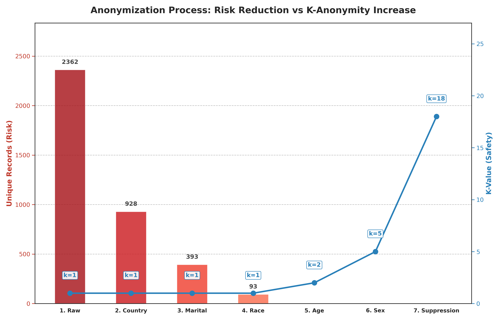
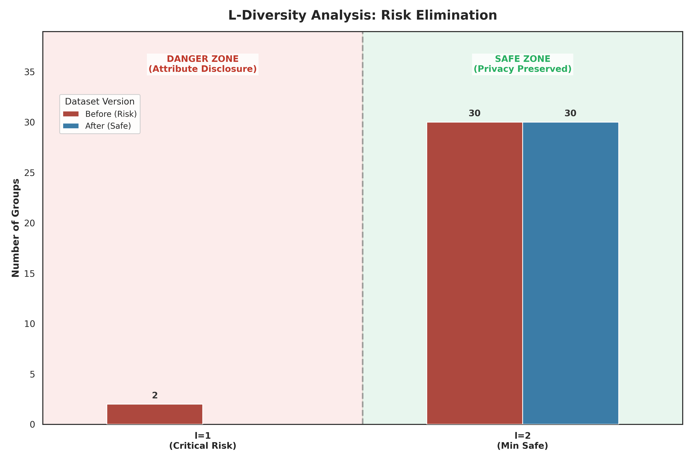
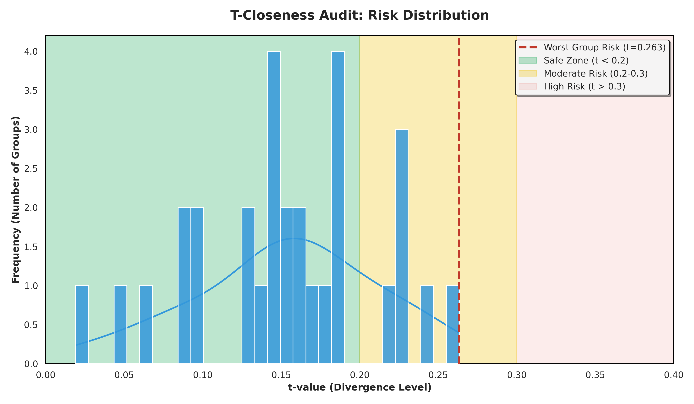

# Privacy Preserving Data Publishing: From Risk to Compliance

  

## 📌 Introduction

This project implements a complete **Privacy Preserving Data Publishing (PPDP)** pipeline using the **UCI Adult Dataset**. The goal is to transform a raw, legally non-compliant dataset into a privacy-preserved version that supports data analysis while protecting individual privacy.

The pipeline applies three advanced privacy models sequentially: **$k$-Anonymity**, **$l$-Diversity**, and **$t$-Closeness**, ensuring the data is robust against Re-identification, Attribute Disclosure, and Skewness attacks.

---

## 🚨 The Context: Why is the raw data "Dangerous"?

The starting point is the [UCI Adult Dataset](https://archive.ics.uci.edu/dataset/2/adult) (Census Income), a standard machine learning dataset. While "anonymized" in name, it contains **Quasi-Identifiers (QIs)**—attributes that, when combined, can uniquely identify an individual.

### GDPR Compliance Issues

Under the **General Data Protection Regulation (GDPR)**, this raw dataset poses significant legal risks:

- **Violation of Art. 4 (Personal Data):** The combination of _Age, Zip, Sex, and Race_ allows for "Singling Out" individuals.
- **Linkage Attack Risk:** An attacker can link this dataset with a public voter list to reveal the sensitive attribute (_Income_).

> **Status Quo:** The raw dataset is **NOT compliant**. My initial analysis showed a $k$-anonymity of **1**, meaning specific individuals are unique and identifiable with 100% certainty.

---

## 🛡️ Theoretical Framework: The 3 Pillars

To achieve compliance (Recital 26 of GDPR), I implemented a layered defense strategy.

### 1. $k$-Anonymity (The Shield)

- **Definition:** A release provides $k$-anonymity if each record is indistinguishable from at least $k-1$ other records within the dataset.
- **Protects Against:** **Identity Disclosure** (Re-identification).
- **My Approach:** I used **Generalization Hierarchies** (e.g., mapping specific ages `24` $\to$ range `18-29`, mapping specific countries to `US` or `Non-US`).

### 2. $l$-Diversity (The Fog)

- **Definition:** An equivalence class has $l$-diversity if it contains at least $l$ "well-represented" values for the sensitive attribute.
- **Protects Against:** **Attribute Disclosure** (Homogeneity Attack).
- **Why I needed it:** Even with high $k$-anonymity, if a group of 100 people all have `Income > 50K`, the privacy is broken.
- **My Approach:** Since generalization reached its limit, I applied **Suppression** (deleting groups where diversity $< 2$).

### 3. $t$-Closeness (The Balance)

- **Definition:** An equivalence class has $t$-closeness if the distance between the distribution of a sensitive attribute in this class and the distribution of the attribute in the whole table is no more than a threshold $t$.
- **Protects Against:** **Skewness & Similarity Attacks**.
- **My Approach:** I audited the final dataset using the Variational Distance metric to ensure semantic closeness.

---

## ⚙️ The Pipeline & Results

I developed a Python pipeline to audit, sanitize, and verify the data.

### Step 1: Risk Assessment (`risk_analyser.py`)

I analyzed the raw data to establish a baseline.

- **Result:** $k=1$. Critical failure.
- **Observation:** Thousands of rows were unique.

### Step 2: Anonymization (`anonymiser.py`)

I applied transformations to the Quasi-Identifiers (`age`, `sex`, `race`, `native-country`, `marital-status`).

1.  **Generalization:** I grouped attributes to increase anonymity.
    - _Result:_ $k$-anonymity increased from 1 to **5**.
2.  **Suppression:** I enforced $l$-diversity by removing groups with insufficient variety (where all members shared the same income).
    - _Result:_ All remaining groups satisfy $l \ge 2$.
    - _Note:_ As a beneficial side effect of suppressing these risky outliers, the final global $k$-anonymity rose from 5 to **18**.

### Step 3: Visual Audits

#### A. $k$-Anonymity Visualization

I tracked how the risk (unique records) dropped to zero while safety ($k$) increased throughout the generalization steps.



> **Interpretation:** This dual-axis chart illustrates the anonymization trajectory. The **Red Bars** (left axis) represent the number of unique, re-identifiable records, which drops from 2,362 to 0. The **Blue Line** (right axis) tracks the $k$-value. Note that while generalization reduced unique records, the $k$-value remained low ($k=5$) until the final **Suppression** step, where removing the few remaining outliers caused the global safety score to spike to a robust **$k=18$**.

#### B. $l$-Diversity Distribution

I verified that no groups remained in the "Danger Zone" ($l=1$), which would indicate a lack of diversity in the sensitive attribute.



> **Interpretation:** This comparison highlights the elimination of attribute disclosure risks. The **Red Bar** (Before) reveals the initial presence of equivalence classes with $l=1$ (where 100% of the group shares the same income, putting them at critical risk). The **Blue Bars** (After) confirm that in the final dataset, the "Danger Zone" is completely empty. All released groups now satisfy the minimum safety requirement of **$l \ge 2$**.

#### C. $t$-Closeness Audit

Finally, I analyzed the semantic proximity between the local distribution of income in each group and the global distribution.



> **Interpretation:** This histogram displays the distribution of **Variational Distance** scores across all equivalence classes. The **Dashed Red Line** marks the worst-case scenario found in the dataset ($t=0.263$). Since this maximum value falls within the "Moderate Risk" yellow band ($0.2 < t < 0.3$) and no groups enter the "High Risk" red zone ($t > 0.3$), the dataset successfully preserves the global statistical structure while protecting privacy.

---

## 🚀 How to Run

1.  **Install Dependencies:**

    ```bash
    pip install pandas seaborn matplotlib numpy
    ```

2.  **Run the Orchestrator:**
    This script runs the full analysis, anonymization, and auditing sequence in order.

    ```bash
    python src/main.py
    ```

3.  **Explore Outputs:**
    Check the `data/` directory for the `adult_anonymized.csv` and the generated charts.

---

## 🎓 Conclusion & Author's Note

This project was developed out of **personal interest** to deepen the understanding of concepts explored during a **University Cybersecurity Course**.

While $k$-anonymity is a foundational concept, this project highlights that **privacy is not a single metric**. Real-world compliance requires a multi-faceted approach ($k$-Anonimity, $l$-Diversity, $t$-Closeness) to protect against sophisticated attacks while preserving the statistical value of the data for research.
